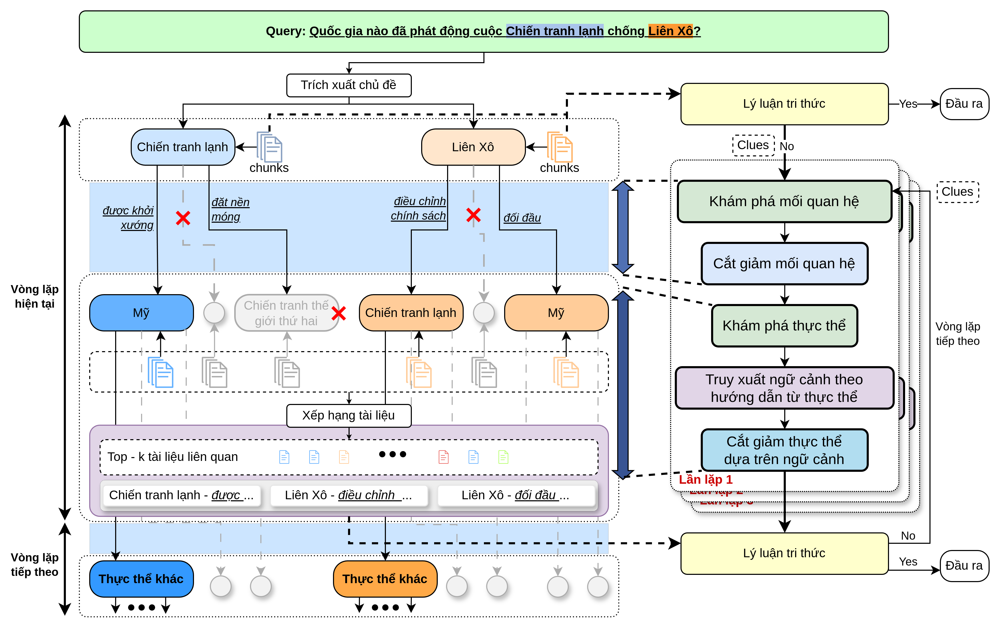

# Graduation-Thesis

This project studies how vector-based retrieval systems handle broad questions while graph-based approaches excel at complex reasoning across multiple documents. By integrating both, it aims to boost accuracy and performance for domain-specific Chatbots.

## The pipeline

## Project Structure

-   **`requirements.txt`**: Pip environment file.
-   **`exam_data/`**: Evaluation datasets.
<!-- See **`exam_data/README.md`** for details. -->
-   **`doc_data/`**: Neo4j database configuration and document datasets.
<!-- See **`doc_data/README.md`** for details. -->
-   **`latex/`**: Contains project documentation.
-   **`pipeline/`**: Source code.
    -   **`main.py`**: Pipeline of this project.
    <!-- Refer to `README.md` for usage. -->
    -   **`instruction_list.py`**: Holds prompts for pruning, reasoning, and generating responses.
    -   **`utils.py`**: Utility functions used across the project.

## Getting Started

Ensure you have installed and configured Neo4j. Refer to the folder’s README.md for setup details. Required libraries are listed in `requirements.txt`.

## How to run

See **`pipeline/`** README.md
